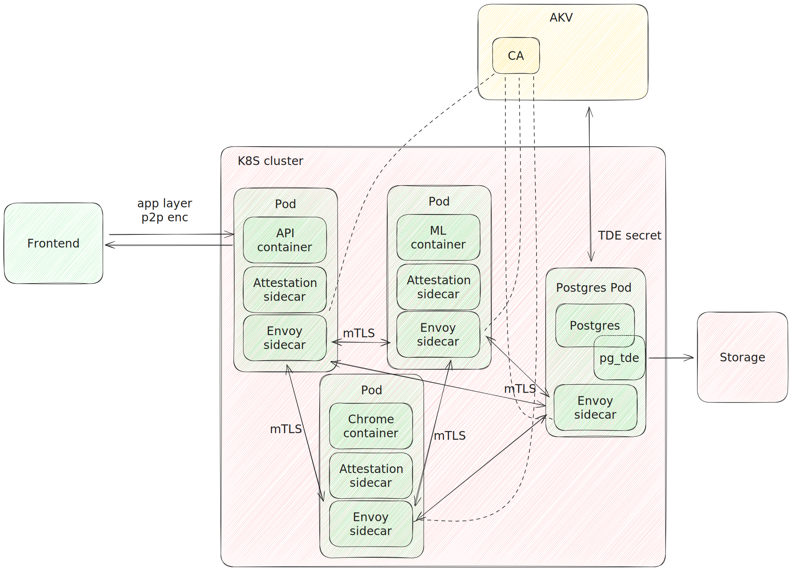
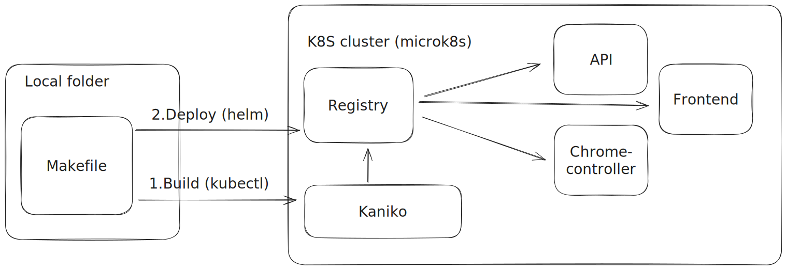
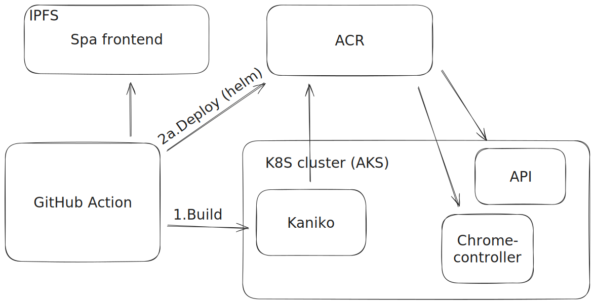

# EnclaveID

Monorepo with the core services. Ideally we move the data pipeline in here as well.

## Architecture



First, there are two types of initContainers that run in this sequence:
- `init_secrets`
- `init_envoy`

`init_secrets` populates the secrets in akv (with the skr policy in prod)

`init_envoy` downloads the CA cert and the secret key from AKV, verifies the CA derivation (since MS doesnt support skr for certs yet) and sets up the envoy sidecar with mTLS, only accepting connections within the cluster that have certificates issued by the same CA.

All disk operations in the initContainers are done on `tempfs`, which is in memory and so untamprable bc of SEV-SNP.

The `remotefs` sidecar provided by MS (https://github.com/microsoft/confidential-sidecar-containers/tree/main/cmd/remotefs) mounts a r/w filesystem encrypted using the master secret in AKV.

TODO: fix the arch doc. attestaation sidecar only necessary in APi for remote attestation with client.

## Development

We distinguish 3 different environments in the development cycle:

- `NODE_ENV==="development"` + no cluster: API and frontend development.
- `NODE_ENV==="production"` + microk8s: for development and testing of all features, excluding confidentiality.
- `NODE_ENV==="production"` + aks: actual production, with confidentiality.

K8s fodler structure:
- `build/`: kaniko configs for build stage
- `containers/`: auxiliary containers (initContainers, sidecars)
- `helm/`: helm chart for deployment
- `renders/`: helm chart renders 
- `scripts/`: auxiliary scripts to customize the renders

## Build and deploy

To install the requirements:

```
sudo dnf -y install skopeo jq helm
sudo snap install yq
```

We build the images using Kaniko with the `--reproducible` flag, so that they can be verified.

Once the images are built, their immutable SHA is set in the source code for attestation purposes.

### Local (microk8s)



To setup the `microk8s` cluster for local development:

```bash
# Install MicroK8s
sudo snap install microk8s --classic

sudo usermod -a -G microk8s $USER
newgrp microk8s

microk8s status --wait-ready
microk8s enable dns registry dashboard storage helm helm3 metrics-server

# To access the dashboard
microk8s dashboard-proxy
```

Running `make` at the project root will spin up a Kaniko pod for each application that has a `Dockerfile`. The built images will be stored in the local microk8s registry.

To render the chart with the newly built images, run `make helm-chart DEPLOYMENT=microk8s`. This will disable the attestation verification code, since the kata UVM is not running.

TODO: add intructions for deployment

### Prod (AKS)



https://learn.microsoft.com/en-us/azure/aks/deploy-confidential-containers-default-policy

In production, a GitHub action invokes `make all` to build the images with Kaniko, which pulls the sources from the GitHub repo and pushes the artefacts to MCR.

Another action takes the image hashes from MCR and renders the Helm chart with `make helm-chart DEPLOYMENT=aks`. This will also set the `enable_confidentiality` feature flag, to use the UVM policy stuff.

TODO: add intructions for deployment

For the fronted there is a `fleek-build` script specifid in `package.json`, which is picked up by Fleek when there are new pushes to master. This deploys the sourcemapped frontend to IPFS to make it auditable and immutable.

## Verification

In order to verify the integrity of the images in the registry you can rerun the Kaniko builds as they are specified in the CI. (assuming the source code is safe)

You can then pull the images from the registry and verify that the files' SHAs are matching.

(provide script that does this easily)
