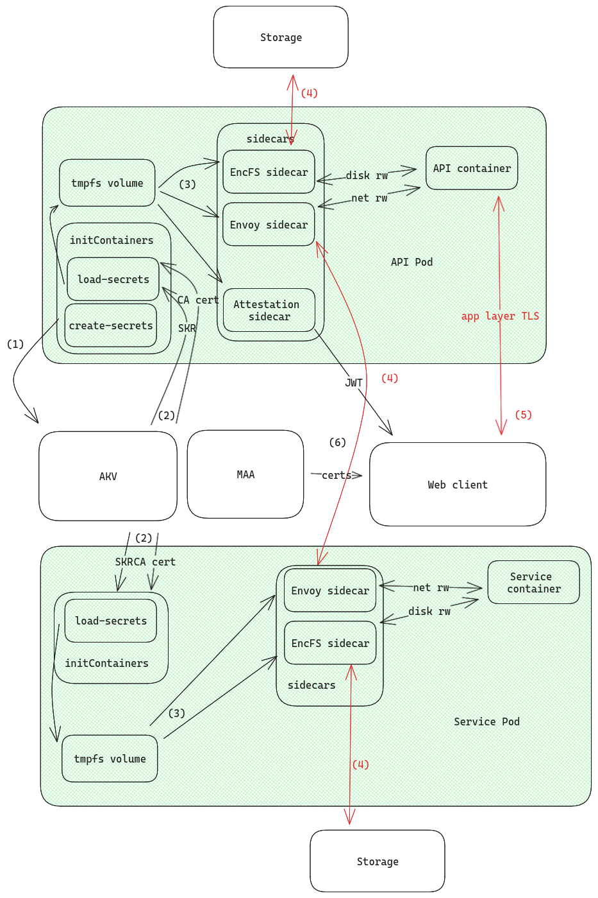

# EnclaveID

Trello board: https://trello.com/b/jsbSDdMQ/enclaveid

## Architecture

The following diagram showcases how the cluster is set up to leverage AKS-CC to guarantee confidentiality.

We only show one example service in the diagram, but any other service would be configured in the same way.

The components that belong to the trusted computing base (TCB) are highlighted in green (the Kata confidential pods running on AMD SEV-SNP capable nodes).



At first, two types of initContainers will be run in this sequence:

- `create-secrets` (API only)
- `load-secrets`

**(1)** `create-secrets` is in charge of creating the mHSM in Azure and initializing the master secret, upon which the confidentiality of the system relies, and uploading it to the mHSM.

The mHSM is created with purge protection on, making it impossible for a malicious susbcription owner to delete and replace the vault and the master secret.

At the moment, the mHSM security domain is be created with a set of private keys that will be thrown away as soon as the initContainer finishes its execution. This guarantees that no one can access the master secret, not even Microsoft or the subscription owner.

The master secret will have an immutable secure key release (SKR) policy, which only allows the confidential pods to access it.

Additionally, as we cannot attest the immutability of the allowed operations for the master secret in AKV, we deterministically derive another intermediate secret from the master secret, which will be the actual key used to encrypt the remote filesystem and issue TLS certificates.

With this intermediate secret, we create and store a CA certificate in the mHSM.

**(2)** In each pod, `load-secrets` downloads the master secret and the CA cert from the mHSM and stores them in an in-memory `tmpfs` volume shared with the rest of the pod, so that the other containers can access them without leaving the TCB.

The container derives the intermediate secret in the same way the API did, and then asserts that the CA certificate is correctly derived from it, since Microsoft does not support SKR for AKV certificates yet.

Once this verification is done, it self-issues a TLS certificate using the CA and stores it in the `tmpfs` volume alongside the other certs and keys.

**(3,4)** The EncFS and Envoy sidecars pick up the CA cert and the intermediate secret from the `tmpfs` volume and set up mTLS and the remote filesystem (only accepting connections with certs isssued by the same 'secret' CA).

The API pod also spins up a Remote Attestation sidecar, with which the web client can get a report that attests the integrity of the whole cluster.

**(5)** The web client communicates with the API via a custom app-layer encryption protocol similar to aTLS. To this end, the attestation sidecar will also include a hash of its TLS certificate in the report, binding the certificate to the code integrity guarantees.

In this way the end user does not need to manually check the certificate in their browser, as the client code will do it for them.

The web client is source-mapped and hosted on IPFS, so that the frontend is immutable and auditable.

This setup guarantees to the user that no uninted third party can access their raw private data.

## Verification

In order to independently verify the confidentiality of the system, the following assets need to be checked:

- The Kata policy measurement
- The image digests in the Kata policy
- The frontend code on IPFS

You can run `./verify.sh` from the root of the repository to check each of them.

**Kata policy measurement**

`make helm-chart` will render the Helm chart into two separate files, one pertaining the Kata specific configuration and the other the rest of the cluster.

`az confcom...` will take the Kata config and produce a policy measurment, which should match the one in the attestation report.

**Image digests in the Kata policy**

All container images are built with Kaniko using the `--reproducible` flag, so that the SHAs are deterministic.

In the Helm chart, the images are referenced by their SHAs, binding the code to the attestation report.

The script will build all images and check that the SHAs match the ones in the Kata spcific configuration rendered before.

**Frontend code on IPFS**

This one is easy: build the frontend from the repo release and compare the file hashes with the ones on IPFS.

## Development

We distinguish 3 different environments in the development cycle:

- `NODE_ENV==="development"` + no cluster: API and frontend development.
- `NODE_ENV==="production"` + microk8s: for development and testing of all features, excluding confidentiality.
- `NODE_ENV==="production"` + aks: actual production, with confidentiality.

K8s folder structure:

- `build/`: kaniko configs for build stage
- `containers/`: auxiliary containers (initContainers, sidecars)
- `helm/`: helm chart for deployment
- `renders/`: helm chart renders
- `scripts/`: auxiliary scripts to customize the renders

## Deploying to microk8s

To install the requirements:

```
sudo dnf -y install skopeo jq helm
sudo snap install yq
```

To setup the `microk8s` cluster for local development:

```bash
# Install MicroK8s
sudo snap install microk8s --classic --channel=1.29

sudo usermod -a -G microk8s $USER
newgrp microk8s

microk8s status --wait-ready
microk8s enable dns registry dashboard hostpath-storage metrics-server

# Configure kubectl:
# https://microk8s.io/docs/working-with-kubectl

# To access the dashboard
microk8s dashboard-proxy
```

Prerequisites:

- Run `az login` on host
- Create service principal: `az ad sp create-for-rbac --name enclaveid-dev`
- Create keyvault
- Assign role to keyvault: `az keyvault set-policy --name enclaveid-dev --spn 1c79e8e8-67d1-4dd8-a15a-d2d34f5902ec --key-permissions all`

Deployment:

Create a .env file in `/createSecrets` with the service principal credentials

Running `make build` at the project root will spin up a Kaniko pod for each application that has a `Dockerfile`. The built images will be stored in the local microk8s registry.

To render the chart with the newly built images, run `make helm-chart && kube...`. This will disable the attestation verification code by default, since the kata UVM is not running.

## Deploying to AKS in prod

For the fronted there is a `fleek-build` script specifid in `package.json`, which is picked up by Fleek when there are new pushes to master.

In production, a GitHub action invokes `make all` to build the images with Kaniko, which pulls the sources from the GitHub repo and pushes the artefacts to MCR.

Another action takes the image hashes from MCR and renders the Helm chart with `make helm-chart`. This will also set the `enable_confidentiality` feature flag, to use the UVM policy stuff.

In order to deploy to AKS in production, there are a bunch of things to configure.

Set up a resource group in Azure: `enclaveid-prod`

Reference: https://learn.microsoft.com/en-us/azure/aks/deploy-confidential-containers-default-policy

Set some env vars:

```bash
AZURE_RESOURCE_GROUP=enclaveid-prod

AZURE_CLUSTER_NAME=enclaveid-cluster
AZURE_NODE_VM_SIZE=Standard_DC4as_cc_v5

AZURE_REGION=eastus2
AZURE_SERVICE_ACCOUNT_NAME=enclaveid-cluster-identity-sa
AZURE_SUBSCRIPTION=$(az account show --query id --output tsv)
AZURE_USER_ASSIGNED_IDENTITY_NAME=enclaveid-cluster-identity
AZURE_FEDERATED_IDENTITY_CREDENTIAL_NAME=enclaveid-cluster-identity-credential

MAA_ENDPOINT="sharedeus.eus.attest.azure.net"
```

Requirements setup:

```bash
# Install aks-preview extension
az extension add --name aks-preview
az extension update --name aks-preview

# Install confcom extension
az extension add --name confcom
az extension update --name confcom

# Register Kata CoCo feature flag
az feature register --namespace "Microsoft.ContainerService" --name "KataCcIsolationPreview"

# Verify registration status and refresh registration status in resource provider
az feature show --namespace "Microsoft.ContainerService" --name "KataCcIsolationPreview"
az provider register --namespace "Microsoft.ContainerService"
```

Deploy a new cluster (this starts billing the VMs):

```bash
# Create the cluster with one system node (need the same CVM type bc of kata)
az aks create --resource-group "${AZURE_RESOURCE_GROUP}" --name "${AZURE_CLUSTER_NAME}" --kubernetes-version 1.29 --os-sku AzureLinux --node-vm-size "${AZURE_NODE_VM_SIZE}" --node-count 1 --enable-oidc-issuer --enable-workload-identity --generate-ssh-keys

# Get cluster credentials
az aks get-credentials --resource-group "${AZURE_RESOURCE_GROUP}" --name "${AZURE_CLUSTER_NAME}" --overwrite-existing

# Add a nodepool with 2 nodes for the enclaveid workloads (excluding ML)
az aks nodepool add --resource-group "${AZURE_RESOURCE_GROUP}" --name nodepool2 --cluster-name "${AZURE_CLUSTER_NAME}" --node-count 2 --os-sku AzureLinux --node-vm-size "${AZURE_NODE_VM_SIZE}" --workload-runtime KataCcIsolation
```

Setup Federated Identity

```bash
# Get the OIDC issuer
AKS_OIDC_ISSUER="$(az aks show -n "${AZURE_CLUSTER_NAME}" -g "${AZURE_RESOURCE_GROUP}" --query "oidcIssuerProfile.issuerUrl" -otsv)"

# Create a managed identity for the cluster
az identity create --name "${AZURE_USER_ASSIGNED_IDENTITY_NAME}" --resource-group "${AZURE_RESOURCE_GROUP}" --location "${AZURE_REGION}" --subscription "${AZURE_SUBSCRIPTION}"

# With the setup complete, we can now use MANAGED_IDENTITY in the initContainer
# and USER_ASSIGNED_CLIENT_ID in the ServiceAccount config
```

Deploy the Kata-agnostic portion of the Helm chart:

```bash
# Render the chart
make helm-chart DEPLOYMENT=aks AZURE_RESOURCE_GROUP=$AZURE_RESOURCE_GROUP AZURE_USER_ASSIGNED_IDENTITY_NAME=$AZURE_USER_ASSIGNED_IDENTITY_NAME

kubectl apply –f k8s/renders/k8s-configs.yaml
```

Create the federated identity credential between the managed identity, service account issuer, and subject:

```bash
az identity federated-credential create --name ${AZURE_FEDERATED_IDENTITY_CREDENTIAL_NAME} --identity-name ${AZURE_USER_ASSIGNED_IDENTITY_NAME} --resource-group ${AZURE_RESOURCE_GROUP} --issuer ${AKS_OIDC_ISSUER} --subject system:serviceaccount:default:${AZURE_SERVICE_ACCOUNT_NAME}
```

Set up the KV with the right roles:

```bash

```

Deploy the Kata portion of the Helm chart:

```bash
kubectl apply –f k8s/renders/kata-configs.yaml
```
